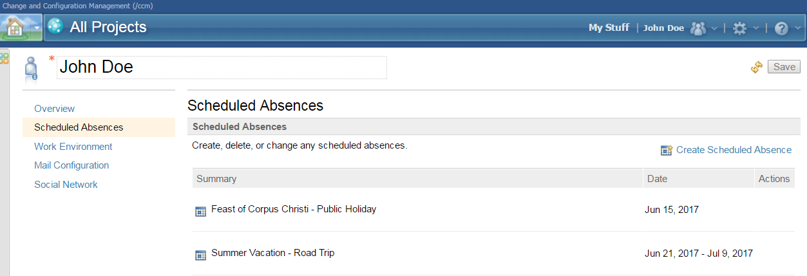
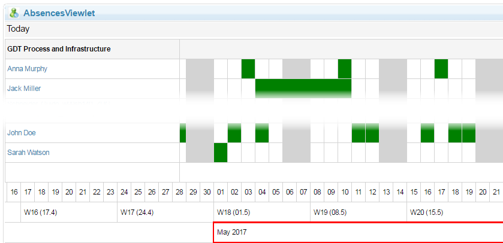

# RTC Dashboard Widget to visualize Scheduled Absences

## Idea and Goal
This project delivers a new widget for RTC (Rational Team Concert) to support a team's capacity planning by visualizing the Scheduled Absences of each user in a team. 

### Add Scheduled Absences
Managing Scheduled Absences is an out of the box feature in RTC.



Please note that the plugin itself doesn't contain an importer to do this automatically, but you could evolve a process like the following:
- Export a list of all Jazz User
- Pull Scheduled Absences out of your primary calendar system (e.g. Google Calendar, Microsoft Exchange, ...) and filter them for specific keywords
- Import all Absences. You could build something based on this code snippet:
```java
private void createAbsence(IContributor contributor, String summary, Timestamp startDate, Timestamp endDate) throws TeamRepositoryException {
	ContributorAbsence absence = (ContributorAbsence) IContributorAbsence.ITEM_TYPE.createItem();
	absence.setContributor(contributor);
	absence.setStartDate(startDate);
	absence.setEndDate(endDate);
	absence.setSummary(summary);

	IResourcePlanningClient rpc = (ResourcePlanningClient) this.teamRepository.getClientLibrary(IResourcePlanningClient.class);
	OperationStatus<IContributorAbsence> status = rpc.saveAbsences(new IContributorAbsence[] { absence }, null);
}
```

### Using the Widget
The Widget itself can be used like any other Dashboard Widget. As soon as you have it configured, It will somehow like this:


The widget is available as a serverside plugin, which can be installed on any RTC (CCM) instance.

## Compatibility
The Widget works for CLM V.4.0.3 and later. Currently it is in successful operation on V.6.0.3.

## Releases
Today we offer you a binary distribution, which can be downloaded from this project and installed on your system. The current stable release can be downloaded directly from the [Releases](https://github.com/jazz-community/rtc-absence-widget/releases) page.

## Installation
Deploy just like any other update site:

1. Extract the `com.siemens.bt.jazz.absence.viewlet.absence-update-site.ini` **file** from the zip file to the `server/conf/ccm/provision_profiles` directory
2. Extract the `com.siemens.bt.jazz.absence.viewlet.absence-update-site` **folder** to the `server/conf/ccm/sites` directory
3. Restart the server

## Update existing installation
1. Request a server reset in one of the following ways:
    * If the server is currently running, call `https://server-address/ccm/admin/cmd/requestReset`
    * Navigate to `https://localhost:9443/ccm/admin?internaltools=true` so you can see the internal tools (on the left in the side-pane). Click on `Server Reset` and press the `Request Server Reset` button
    * If your server is down, you can delete the ccm `built-on.txt` file. Liberty packed with 6.0.3 puts this file in a subfolder of `server/liberty/servers/clm/workarea/org.eclipse.osgi/**/ccm`. The easiest way to locate the file is using your operating system's search capabilites.
2. Delete previously deployed updatesite folder
3. Follow the file extraction steps from the section above
4. Restart the server

## Contributing
Please use the [Issue Tracker](https://github.com/jazz-community/rtc-absence-widget/issues) of this repository to report issues or suggest enhancements.

For general contribution guidelines, please refer to [CONTRIBUTING.md](https://github.com/jazz-community/rtc-absence-widget/blob/master/CONTRIBUTING.md)

## Licensing
Copyright (c) Siemens AG. All rights reserved.<br>
Licensed under the [MIT](LICENSE.md) License.

